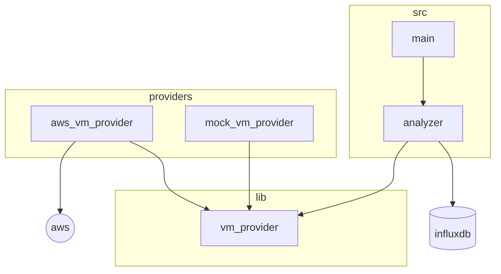

# Ficus Agent

**Agent fetching cloud resources and consumption to store them as timeseries**  
*(work in progress)*  

## Providers

Providers have to be enabled by activating the corresponding features from the `Cargo.toml`.  
Several can be active at the same time.  

### AWS

To use the aws plugin, you need to have a `~/.aws.credentials` file with the following content:  
```toml
[default]
aws_access_key_id=YOUR-ACCESS-KEY
aws_secret_access_key=YOUR-SECRET-KEY
region=YOUR-REGION
```

### Mock

This plugin only serves test and showcase purpose.  

## Timeseries

The ficus agent currently only supports influxdb.  
Copy the `.influx.toml.example` config file into `.influx.toml`, and change with the proper values to connect to your influxdb instance.  

# Development

## Run locally

You'll need docker and the rust toolchain.  
- In the `local` folder, run `docker compose up -d` to start influxdb container
  - You need a `.influx.toml` config file; the values in `.influx.toml.example` match the local container default ones
- In the root project folder, run `cargo run`

## Project architecture



*Providers are abstracted through the lib to ease implementation*  
